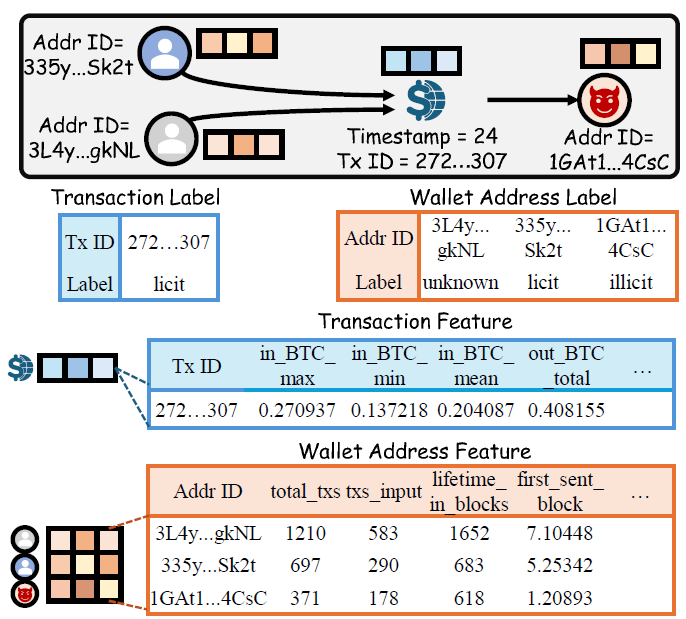

# BitHeteroNet

The source code and dataset for the WWW'26 paper "BitHeteroNet: A Heterogeneous Network Benchmark for Enhanced Anomaly Detection in Bitcoin Transactions".



## Data
Due to the large storage requirements of our dataset, it is publicly available via Google Drive [link](https://drive.google.com/drive/folders/1ZGx0hQYyK7B5rU0G_gGqIu_wbqYbP4wY?usp=sharing).

### Storage Files for BitHeteroNet Information

*The `*.npy` files are loaded through the Numpy package. The `data.pkl` is a dictionary with multiple keys saved in pickle format.*

Feature & Label Files

| File | Description |
|------|-------------|
| `address_attrs.npy` | The features of wallet addresses |
| `addr_classes.npy` | The labels (0: licit, 1: illicit, 2: unknown) of wallet addresses |
| `tx_features.npy` | The features of transactions |
| `tx_time_step.npy` | The occurrence timestamp of each transaction |
| `tx_classes.npy` | The labels (0: licit, 1: illicit, 2: unknown) of transactions |

Relational Structure Files

| File | Description |
|------|-------------|
| `data.pkl(['Addr2Addr_id'])` | A dictionary mapping from raw wallet address ID to an index |
| `data.pkl(['Tx2Tx_id'])` | A dictionary mapping from raw transaction ID to an index |
| `data.pkl(['Tx_id2Output_Addr_ids'])` | A dictionary mapping from transaction to the output addresses |
| `data.pkl(['Tx_id2Input_Addr_ids'])` | A dictionary mapping from transaction to the input addresses |

### Statistics of the BitHeteroNet Dataset

| Metric | Value |
|--------|-------|
| # Transaction | 202,804 |
| licit: illicit: unknown | 4,545: 41,500: 156,759 |
| # Wallet address | 822,942 |
| licit: illicit: unknown | 14,266: 250,998: 557,678 |
| # Transaction feature | 183 |
| # Wallet address feature | 54 |
| # Timestamps | 49 |

### Wallet Address Features and Descriptions

*(S) represents the feature as a single value, while (M) represents the feature has 5 values: total, min, max, mean, and median*

##### Transaction-related Features

| Feature | Description |
|---------|-------------|
| BTC-transacted (M) | Total BTC transacted (sent+received) |
| BTC-sent (M) | Total BTC transacted (sent) |
| BTC-received (M) | Total BTC transacted (received) |
| Fees (M) | Total fees in BTC |
| Fees-share (M) | Total fees as share of BTC transacted |
| Txs-total (S) | Total number of blockchain transactions |
| Txs-input (S) | Total number of transactions as input addresses |
| Txs-output (S) | Total number of transactions as output addresses |

#### Time-related Features

| Feature | Description |
|---------|-------------|
| Blocks-txs (M) | Number of blocks between transactions |
| Blocks-input (M) | Number of blocks between being an input address |
| Blocks-output (M) | Number of blocks between being an output address |
| Addr interactions (M) | Number of interactions among addresses |
| Lifetime (S) | Lifetime in blocks |
| Block-first (S) | Block height first transacted in |
| Block-last (S) | Block height last transacted in |
| Block-first sent (S) | Block height first sent in |
| Block-first receive (S) | Block height first received in |
| Repeat interactions (S) | Number of addresses transacted with multiple times |

## Baseline
The baseline implements are in the `gnn/` folder.

## Requirements
This code requires the following:
* Python==3.10.14
* dgl==2.2.1+cu121
* dhg==0.9.4
* pyg-lib==0.4.0+pt23cu121
* torch==2.3.0+cu121
* torch-cluster==1.6.3+pt23cu121
* torch-scatter==2.1.2+pt23cu121
* torch-sparse==0.6.18+pt23cu121

## Usage
Run the following script corresponding to the task you want.

### Illicit Address Detection (transductive)
```
python main.py --batch_size=1000 --hid_dim=64 --lr=0.01 --task="addr classification" --tgnn=BitGAT --transduction=true --fold=5
```

### Illicit Address Detection (inductive)
```
python main.py --batch_size=1000 --hid_dim=64 --lr=0.01 --task="addr classification" --tgnn=BitGAT --transduction=false --fold=5
```

### Illicit Transaction Detection (random)
```
python main.py --batch_size=1000 --hid_dim=128 --lr=0.005 --task="tx classification" --tgnn=BitGAT --time_split=false --fold=5
```

### Illicit Transaction Detection (time-based)
```
python main.py --batch_size=4000 --hid_dim=64 --lr=0.001 --task="tx classification" --tgnn=BitGAT --time_split=true --fold=5
```


